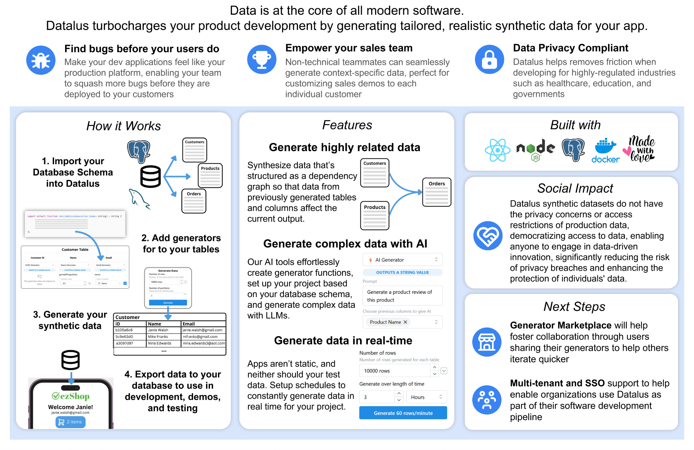
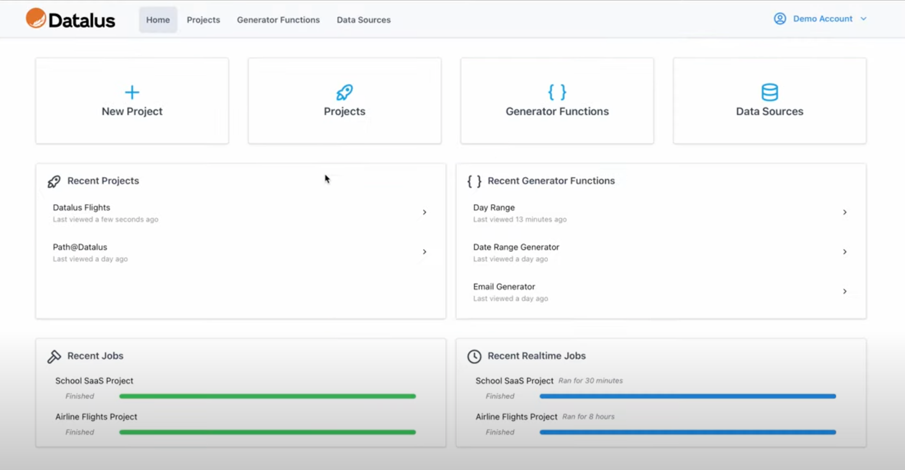

    

# Datalus - Synthetic Tabular Data Generator

## Overview
* Generates realistic development data to streamline ML model fine-tuning, product debugging, and privacy compliance. Capacity for neurosymbolic data generation and relational reasoning as well as integration with plug-and-play language models.
* Won **“Best Technical Innovation”** for Senior Design among 250+ graduating UPenn Computer Science students

    

## Try Now!
Try it out at https://www.datalus.dev (registration pre-launch so contact to be given trial credentials!)

## Demo

