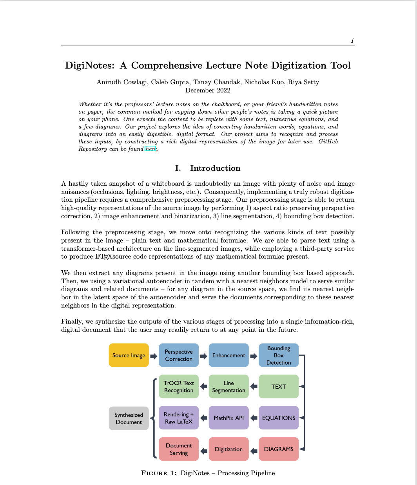
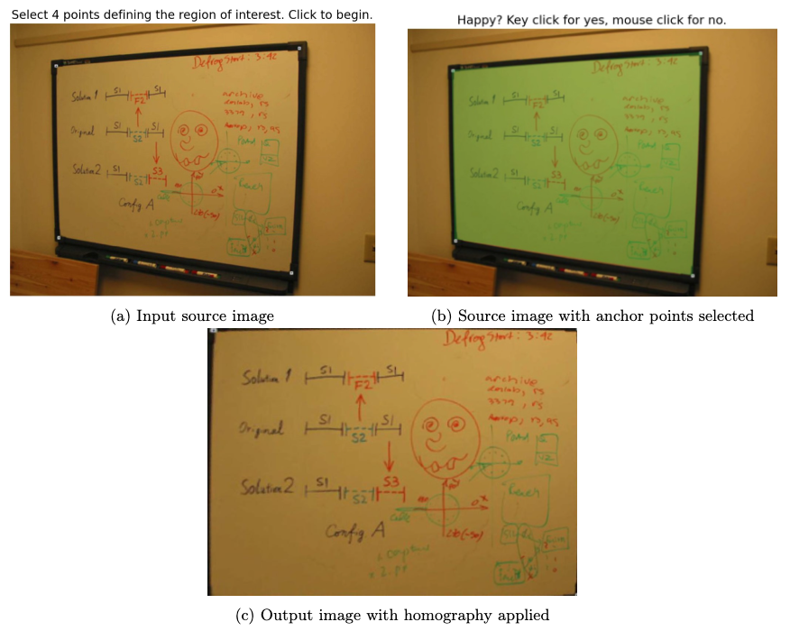
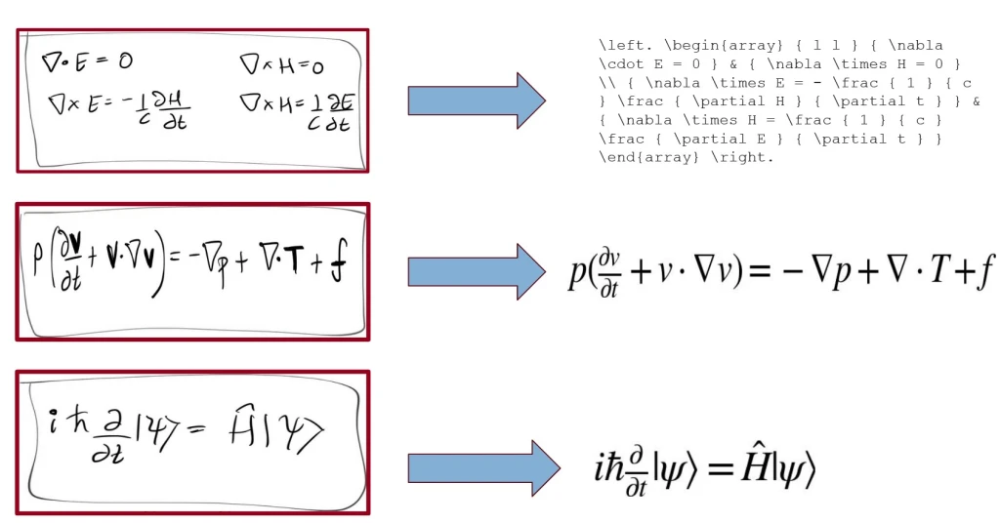

# DigiNotes: Comprehensive Lecture Note Digitization Tool

When it comes to capturing notes, whether they're from a professor's lecture on a chalkboard or a friend's handwritten notes on paper, the easiest method is often to snap a quick photo with your phone. These images usually contain a mix of text, numerous equations, and some diagrams.

Our project delves into the innovative process of transforming these handwritten elements into a digital format that is both accessible and easy to understand. By leveraging advanced recognition techniques, we aim to identify and process words, equations, and diagrams, converting them into a structured digital representation.

This approach not only preserves the content for future reference but also enhances its usability by making it searchable and editable. Our goal is to bridge the gap between physical and digital note-taking, providing a seamless experience that maximizes the utility of captured notes. Through this project, we hope to make information more accessible and user-friendly, supporting learning and productivity.

https://github.com/a-cowlagi/DigiNotes

## Introduction
A hastily taken snapshot of a whiteboard is undoubtedly an image with plenty of noise and image nuisances (occlusions, lighting, brightness, etc.). Consequently, implementing a truly robust digitization pipeline requires a comprehensive preprocessing stage. Our preprocessing stage is able to return high-quality representations of the source image by performing 1) aspect ratio preserving perspective correction, 2) image enhancement and binarization, 3) line segmentation, 4) bounding box detection.

Following the preprocessing stage, we move onto recognizing the various kinds of text possibly present in the image -- plain text and mathematical formulae. We are able to parse text using a transformer-based architecture on the line-segmented images, while employing a third-party service to produce \LaTeX source code representations of any mathematical formulae present.

We then extract any diagrams present in the image using another bounding box based approach. Then, we using a variational autoencoder in tandem with a nearest neighbors model to serve similar diagrams and related documents -- for any diagram in the source space, we find its nearest neighbor in the latent space of the autoencoder and serve the documents corresponding to these nearest neighbors in the digital representation.

Finally, we synthesize the outputs of the various stages of processing into a single information-rich, digital document that the user may readily return to at any point in the future. 

## Technical Exposition

### Perspective Correction
To begin, we apply perspective correction to the input source image of a whiteboard to obtain a front-on view of the whiteboard that takes up the entire canvas. Naturally, we look to compute a homography mapping to to this. However, we require a method more involved than simply mapping the whiteboard to a $\textit{fixed size}$ canvas, as the aspect ratio of the whiteboard is unknown We first build a simple user interface to allow for the perspective correction of any image through the manual selection of anchor points in the image. Next, in order to estimate the ideal canvas size, we estimate the aspect ratio of the region of interest using a pinhole camera model, largely following the approach. We briefly describe this procedure below.

We assume the true object is a rectangle with width $w$ and length $l$ in the $z=0$ real-world coordinate plane. We denote these 4 points $M_1=(0,0), M_2=(w,0), M_3=(0,h), M_4=(w,h)$ in the $z=0$ plane. In contrast, the whiteboard's anchor points $m_1,m_2,m_3,m_4$ form a quadrangle in the coordinate system due to the source image's perspective distortion. We then aim to calculate the focal length of our proposed "pinhole camera" such that the projection of these 4 points of the output rectangle map to the 4 points of the quadrangle in 3D space. For a vector $x=[x_1,...,x_n]^T$, we denote $\widetilde{x} = [x_1,...,x_n,1]^T$. We calculate the focal length of the camera using the pinhole model equation, which projects the 4 rectangular output points onto the quadrangle, as shown below: 

$\lambda \widetilde{m} = A[R t]\widetilde{M}$

where:

NEED TO FILL IN THIS IMAGE

In the above calculation, $f$ is the camera's focal length, $s$ is the \textit{pixel} aspect ratio (assumed to be $s=1$), and (R,t) is the mapping between the world coordinate system and camera coordinate system. Calculating for focal length $f$ and simplifying the pinhole mathematical assumptions, we obtain an estimate of the true aspect ratio of the whiteboard, $(\frac{w}{h})$. We multiply this true aspect ratio with a characteristic side length of 1000 pixels in order to obtain our desired homography scale. Then, we apply the standard homography mapping to map the region of interest to the calculated output image size, generating the results below.

ADD IN AN IMAGE

### Image Enhancement and Adaptive Binarization
Though we may have reoriented the source image to provide a front-on view occupying the entirety of the canvas, there are still issues with the \textit{quality} of the image. For example, lighting and contrast may vary from environment to environment and within regions of the image itself. We need to standardize this input to achieve robust downstream performance. A particularly important component of this standardization procedure is image \textit{binarization} -- constructing a $\{0,1\}$ representation of the image. We now describe the procedure we adopt accomplish both image enhancement and binarization, which is largely adapted from \cite{whiteboard_image_enhancement_opencv_python}.

1. We apply a \textit{Gaussian difference} on the image. That is, we convolve the image using two different Gaussian kernels and take the difference of those images. This emphasizes relevant features in the image, like edges present in text. However, this will result in a low-intensity image, that we additionally take the bitwise inverse of.
2. To increase the contrast in the image, we perform \textit{histogram equalization} \cite{841534}. This procedure makes the overall distribution of pixel intensities in the image more uniform, by stretching out the range of intensities in the image.
3. The contrast improvement procedure may introduce defects into the image. Hence we iteratively perform Gaussian blurring followed by a round of histogram equalization for 2 iterations to both remove such defects while preserving the image contrast and intensity.
4. Finally, we look to binarize the image. Despite the enhancement procedure, it is also possible that different regions are still slightly darker or lighter than others. Hence, we use an \textit{adaptive} binarization procedure that assigns local threshold values using a $5 \times 5$ pixel neighborbood for each pixelhood (Saovola thresholding) \cite{SAUVOLA2000225}.

The result of applying this procedure to a source image that also requires persepctive correction is shown below. 

ADD IN AN IMAGE

### Line Segmentation
The final step in the pre-processing of the input image is to partition it such that each new image represents a singular line, each of which can be feed into optical character recognition stage.

To do so, we start by generating a \textit{horizontal projection profile} \cite{horizontal-proj} that characterizes the sum of the black pixels for every row of the binarized image.

As one can image, this profile exhibits local maxima and minima dependent on where a line ends. Using a threshold dependent on the mean pixel intensity, we identify transitions from below the threshold to above the threshold (upper edge of line) and from above the threshold to below the threshold (lower edge of line). We finally make sure to only retain lines of a predetermined minimum height to limit the effect of noise. The stages of this segmentation pipeline are documented below.

ADD IN AN IMAGE

This leaves us with a set of segmented images that are now ready to be processed using our optical character recognition architectures.

### Text Detection and Recognition
Having preprocessed the images to a usable state, we now move onto employing learning-based approaches to synthesize a usable document. The first task we choose to pursue is recognize and parse \textit{non-mathematical} handwritten text, a procedure known as optical character recognition.

#### TrOCR: Transformed-based Optical Character Recognition
We target an approach that is both sufficiently complex from a parameterization perspective -- it has a high capacity, but readily deployable. Consequently, we use a recently developed transformer-based architecture that employs transformer modules in both the image understanding and the text generation component, \textit{TrOCR} \cite{DBLP:journals/corr/abs-2109-10282}. This is in contrast to traditional text recognition architectures that employ CNNs as the backbone, thereby being resistant to dataset / image-specific inductive biases. A high-level overview of the architecture is provided below.

ADD IN AN IMAGE

The encoder receives an image of a single line, $x_{img} \in \mathbb{R}^{3 \times H_0 \times W_0}$, which is first resized by upsampling/downsampling to a fixed size: $3 \times H \times W$. This image is then broken up into a set of foursquare patches, which are then embedded into a $d$-dimensional space fed into the multihead attention stage. The encoder outputs are then used as the keys and values for the decoder stage, while the queries are the decoder input -- a tokenized representation of the ground truth. \\

When we wish to use the model at inference time, we generate output by refeeding the output at a given step as the input to the next stage. The decoder input is seeded with the [BOS] token, and the final sequence is determined using beam search. The encoder is initialized at generic ViT weights, while the decoder uses a BERT-style representation. The weights for the model we use are finetuned on millions of handwritten textline images. To access the pretrained models, we use the HuggingFace Transformers API \cite{hugging-face}. \\

Below, we show the TrOCR output predictions on a few lines of text. 

ADD IN AN IMAGE

#### MathPix: Equation Detection and Recognition
As promised, we are able to process mathematical formula and equations in addition to plain text. The goal of this stage is to return a \LaTeX representation of the image as well as a digitized rendering of this equation as in the previous part. We employ an entirely different strategy in this case. First, we need to distinguish equations from text, else the previous stage would attempt to decode equations as text. Consequently, we impose the restriction that equations are boxed in red -- though the bounding box is not assumed to be perfectly rectangular. We adopt the following approach to extract equations for the recognition stage.
1. Apply a morphological gradient to the enhanced (non-binarized) image
2. Label the connected component that each pixel in the source image belongs to using \\ \texttt{scipy.ndimage.label} and select all connected components of a minimum size
3. Discard all bounding boxes where the mean red channel is not more than 1.5 $\times$ the mean blue and red channels
4. Discard all bounding boxes that are within other bounding boxes, and return the final bounding boxes

After extracting these bounding boxes, we move onto parsing these equations. Though it would be possible to employ TrOCR after additional finetuning, there is insufficient labeled handwritten mathematical equations to achieve the desired level of performance. Hence, we choose to employ the MathPix API \cite{mathpix} for this stage. The service allows an image of the equation to be sent in a request, and returns a JSON packet containing the \LaTeX source code representation of the image, along with a confidence value. We take this source code and a local \LaTeX interpreter to render the equation as a digitized image. The results of this entire procedure are shown below.

ADD IN AN IMAGE

## Image Digitization
The image digitization Process is two-fold in nature. As before, the diagrams must be identified before they can be passed onto downstream processing. The second step is to map these drawings to similar diagrams in the training corpus to serve as related content to the user.

* $\textbf{Diagram Extraction and Digitization}$: As opposed to our processing of equations, we presently request additional input from the user prior to extracting the diagrams. Namely, we request an estimate of the number of diagrams present in the image. With this estimate, we apply methods similar to before: morphological gradient followed by connected component detection, then retaining a mask corresponding to bounding boxes of the largest regions. Namely, we perform the binarization of images with the enhancement and adaptive threshholding routines described above, followed by additional blurring to remove any remaining noise and defects. The was then passed into OpenCV's $\texttt{approxPolyDP}$ method which was used to find the contours and bounding boxes corresponding to the diagram regions.
* $\textbf{Similar Diagram Identification}$: Having identified, extracted, and digitized the diagrams present in the source image, we proceed with the goal of identifying $\textit{similar}$ diagrams to serve to the user. This is a challenging task given the space of possible images is inherently high-dimensional. Still, there is structure shared across images / classes of images, hence we look for an accurate latent space representation, $z = f(x)$ of the source image, $x$, that respects geometric structure.

Naturally, we turn towards the seminal $\textit{variational autoencoder}$ (VAE) architecture. Namely, we use the encoder of a VAE pretrained on a large-scale natural image dataset (e.g. ImageNet), which can be seen as modeling the posterior distribution of the latent space, $p(z \vert x)$, to generate a structure preserving latent space representation of the source image. Given this latent space representation, and a corpus of documents $\{x_i\}_{i=1}^{N}$, we simply return the documents from the corpus whose latent space representations are closest to $f(x) = \mu(p(z \vert x))$:

$\text{match}(x) = {\arg \min}_{\{x_i\}_{i=1}^N} \Vert f(x) - f(x_i) \Vert ^2$

In these initial efforts, and due to restrictions on compute availability, we train our own encoder-decoder architecture using a shallow convolutional encoder backbone. Still, we verify the validity of this approach by testing using a concept class of ``linear multi-layer perceptrons" and a small hand-drawn corpus of hand-drawn and digital images, as shown below. 

ADD IN AN IMAGE

## Document Synthesis
The final stage involves merging the different steps of this pipeline, which often runs many tasks in parallel. We were able to finish the synthesis process for documents containing text and equations, but have not yet implemented the integration of digitized images, and leave this as the first stage of any future work.

We choose to output a PDF representation of the notes, and employ the FPDF package to do so. This provides an interface which is able to dynamically render both text and images, with precise control over document formatting. To do so, we simply use the recorded pixel positions of the text and equations in the source image, and construct the PDF using a ``stream" that iterates over these positions from left to right, top to bottom, while logging whether the current piece of content is an equation or plain text.

The output of this synthesis procedure on a sample image is shown below. As of now, the perspective correction stage is skipped to automate the entire procedure (no manual selection of anchor points), though it could be readily and immediately added if desired.

ADD IN AN IMAGE
