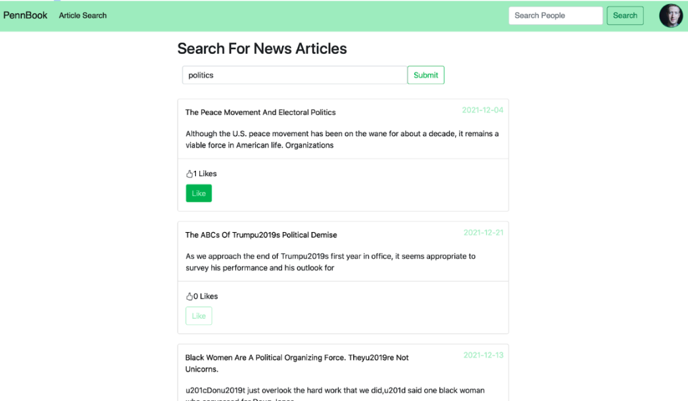

# Facebook Implementation

    

This project is a miniature version of a social media platform that includes all of the standard features including chats, friends, postings, news, visualizations, and more. It was completed in December 2021 with two peers as a final project for a ‘Scalable and Cloud Computing’ course. The technologies used include Bootstrap on the front end, DynamoDB and Amazon S3 for storage, Apache Spark for friend/news/post computations, socket.io for web socket needs regarding chats, and AJAX with jQuery for page integration.

Video Demo Above
## Chat Conversation

    

For the chat, a standalone page was implemented using the socket.io library along with three tables in DynamoDB (Users, Friends, and Chat). In order to have both readability as well as uniqueness for each of the chats, there is both a name (sort key) and a uniqueID (partition key). The name is set by the user at creation time through a popup and the id is automatically generated in the format of: ‘username’ + ‘unix epoch time’. Moving on to the specific tables that were used, the User Tab maintained two lists that were changed with UpdateItem’s ‘list_append’ method as a user either join a chat or is invited to a chat: ChatInvitations and Chats (both of which stored the chatID). The Friends chat is used when inviting others (in conjunction with the User tab to see who is online), as a way to quickly query the friends of any given user. The Chat table maintained the id, name, and a list of JSON stringified messages, each of which held the sender, timestamp, and actual message. The Chat table is sent a message each time the ‘send button’ is clicked, but is only queried when a given user enters the chat because all other messages between users while online are done through socket.io. Creating a chat is done through buttons on either the toolbar or side page of home.ejs. The side page also maintains all current chats and invitations that a user has available to them. 

## News Article Search

    

For the search functionality pertaining to news, an Article Index table is used in order to query for articles based on a particular key word. The results from those would then get sorted based on the number of keywords they matched by storing the articles in a map with the article item as the key and the number of matched terms as the value. The map was built into a sorted array. Then, there is a lookup for all the recs for a given user and there is storage for all of the article recs that have a weight. These weights are then scaled and the list of articles is sent back to the front end for display. An AJAX call is used to give a user’s article recommendations daily. This is done by first obtaining the user’s recommendations, and then cross-referencing these with articles that the user has already been recommended. This involves an Article Recommendations Table and a Given Recommendations table that both have username as a partition key and a list of article IDs as a sort key. Once the most recommended article that is not in a user’s given recommendations is retrieved, then the site will update the current user’s list in the Given Recommendations table or make a new item for them if nonexistent. This recommendation then is sent back to the page and displayed on the front end. Additionally, inside the function call there is a check at the beginning that determines whether an hour has elapsed before making a command line call to run the adsorption algorithm.

## Account Creation

    

    

When a user creates an account, they must fill out all of the provided fields (and they get an alert if they try to submit without doing so). This includes selecting at least two topics they are interested in. A hashed version of the user’s password gets stored in the “users” table; when the user logs in, the hashed version of the input is compared to the version in the table associated with that username. Once logging in, the user’s username is stored as a session variable. If the user attempts to visit a different page without being logged in, they will be redirected to the login page.

## User Feed

    

On the home page, the logged-in user can see their incoming friend requests, new friends, current chats and chat invitations, and a feed of articles and user-created posts sorted by time. Posts, likes, and comments are all dynamically updated every thirty seconds; if another user were to create a post, comment on a post, or like a post, then the feed would update accordingly. Comments that are displayed also feature the commenter’s profile picture. Retrieving the posts requires calls to multiple DynamoDB tables, including a Posts table, Comments table, Likes table, Article Likes, and Users table. Posts are kept track of with a unique post ID, users are kept track of with a unique username, and comments are kept track of with their timestamp. The home page (as well as all the other pages) is rendered with Bootstrap 5 and uses AJAX calls with JQuery to dynamically update the content. Friend requests immediately disappear once they are responded to, and if a request is accepted the new friend will show up under the New Friends section. The home page also allows the user to enter existing chats, respond to chat invitations, and create new chats.

## The Wall

    

The wall mainly relies on the “Users” and “Posts” tables in DynamoDB, as well as an S3 bucket titled “g02.posts” to store profile pictures. When rendering the “About Me” section, a call was made to the “users” table that queried based on the current session username, retrieving information like name, affiliation, email, and a list of interested topics. During this call, the user’s profile picture is also retrieved from the S3 bucket, and in the case that the user has not set one, an image of an anonymous user will be displayed in its place. If the user clicks the “Add Profile Picture” button, they can navigate their files and choose a file of size less than 70kb. If the user clicks the “Update Account Info” button, they can change their email, password, affiliation, and interested topics, where their current information (besides password) is already filled in. Changing affiliation or interests will automatically create a status update for the change. Saving changes will use an AJAX call to update that user’s information in the “users” table.

## Profile

    

Once on their wall, the user has the option of creating a new post with/without media and to their wall or a friend’s wall. If the user chooses to post on their friend’s wall, a modal will appear with a list of their current friends, allowing them to choose one. The wall will dynamically update once a post has been added, and a call will be made that adds the post to our “posts” table.

## Visualizer

    

The visualizer tool in this project is a way to see the connections of an individual beyond the strict follower/follow relationship. As seen to the right (demonstrating the connections of Main User), we are able to see a certain number of our friends friends and can visually see which of these are connected. This tool serves to show a demonstration of how I create friend recommendations (those who are more intertwined with an individuals network are more likely to be presented as a potential friend).

