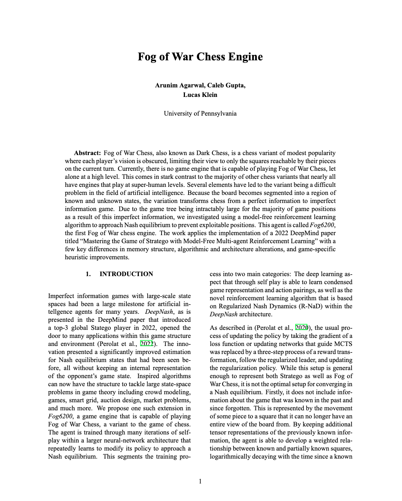
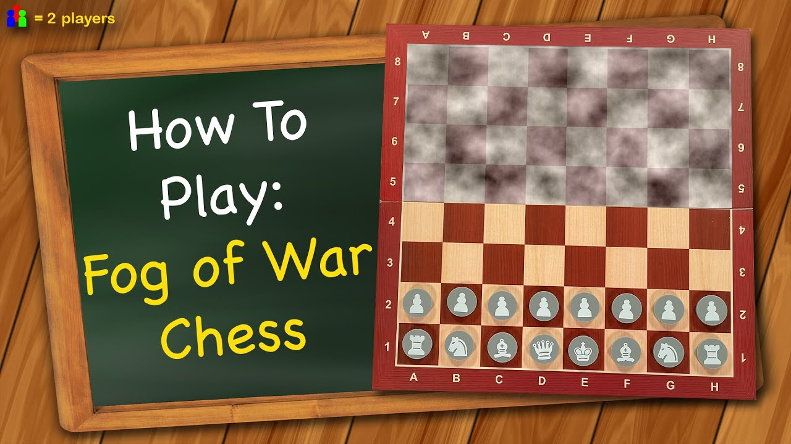
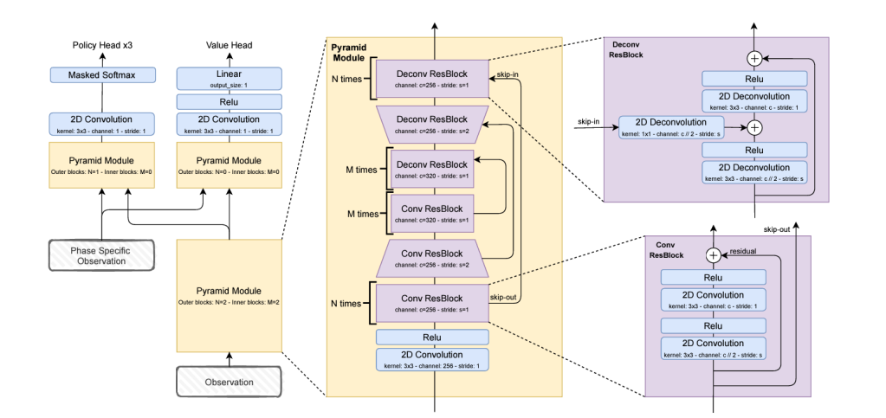

# DarkChess: The first 'Fog of War' chess engine

Fog of War Chess, or Dark Chess, is a chess variant where players can only see the squares their pieces can move to on the current turn, turning it into an imperfect information game. Despite its modest popularity, there are currently no high-level engines for this variant, unlike other chess games with advanced AI. Fog6200 is the first Fog of War Chess engine, developed using model-free reinforcement learning to approximate Nash equilibrium and address the challenges of imperfect information. This engine is inspired by the 2022 DeepMind paper “Mastering the Game of Stratego with Model-Free Multi-agent Reinforcement Learning,” with adaptations in memory structure, algorithm, architecture, and game-specific heuristics.

### Overview
* **Popularity**: One of the more popular chess variants and is available for online play at platforms like Chess.com.
* Fog of War Chess comes in stark contrast to the majority of other chess variants that nearly all have engines that play at super-human levels.
* Because the board becomes segmented into a region of known and unknown states, the variation transforms chess from a perfect information to **imperfect information game**. Due to the game tree being intractably large for the majority of game positions as a result of this imperfect information, we investigated using a model-free reinforcement learning algorithm to approach Nash equilibrium to prevent exploitable positions.
* The work applies the implementation of a 2022 DeepMind paper titled ``Mastering the Game of Stratego with Model-Free Multi-agent Reinforcement Learning" with key differences in memory structure, algorithmic and architecture alterations, and game-specific heuristic improvements.

### Rules

1. **Limited Visibility**: You can only see your own pieces and any opponent's pieces that are directly attackable.
2. **Hidden Opponent Pieces**: Opponent's pieces remain hidden unless they are in a position to be captured.
3. **Standard Chess Moves**: All conventional chess rules apply, including castling, en passant, and pawn promotion.
4. **Objective**: The primary goal is to checkmate the opponent’s king, requiring strategic planning with partial information.

### Architecture
Let us contrast the key differences in the imperfect information that exist between a game such as Stratego and Fog of War Chess. In Stratego, there is perfect information about ones own pieces (meaning both location and type), while there is inperfect information only in the types about ones opponents pieces. Contrarily, in Fog of War chess there is perfect information about ones own pieces (again relaying to location and type), perfect information about the opponents visualized pieces, imperfect information about some of the opponents pieces with regards to type and location, as well as semi-perfect information of both location and type of pieces that had recently been seen. Due to this distinctions, several approaches were needed to be included so that the essence of the algorithm would still hold value. 

  

While similar to the Stratego AI in that it holds both piece-to-type assignments and private and public information tensors, they are distinct in how they are represented to be able to account for incomplete information gain and differing pieces of imperfect information. Note that a piece-to-type assignment for a player is the knowledge of every pieces position that is on the board and can be accounted for by a 8x8x7x10 board where the first two dimensions represent the row and column of the board, whereas the third dimension represents the piece assignment (pawn, rook, knight, bishop, queen, king, or empty), and where the last dimension represents a 9 move state history of the last time that it was seen (if it had even been seen, otherwise 10 is representative of unobserved).

## Details
### Fog of War Game Strategy
Several elements of strategy are distinctly different between chess and its Fog of War variation, which are key in analysis of what the agent is able to learn. This is distinctly important because no game tree models examinations that are possible in chess are available in the variant as it is unclear what the position of the opponent is, making it all the more important what strategies are built in. The most important feature that should be represented within any capable agent is the King safety. While this is also the case in normative chess, it becomes all the more important due to the unknown attacks that could be aimed toward the king. This is further distinct in that protection does not mean not getting attacked, but also requires more protection in that the attack could come from any unknown direction and select formations are optimal for that protection. 

Another key element to the game that is not represented in chess is the misdirection that is applied in order to limit the information of the opponent. This is one of the reasons why better bounds on exploitability can be found with stochastic choosing of actions rather than a simple selection of the highest probability which would result in an opponent having improved predictions of the game state. Human Fog of War chess play often evolves in a more conservative, defensive manner, in line with this approach. 

Another important aspect to the game is the movement of pieces to expand the vision of the board. In the perfect information standard version of chess, there is no incentive to move pieces in order to see what they see because the entire board is always visible. This furthers the value of active pieces from those that are involved in the game to those that can improve the knowledge state of the game. 

In a similar vein, sacrifices in order to gain information about the state of the game now has a merit compared to the original game where such a concept would not make sense. In analyzing the strategies that come from this approach, it introduces several new chess openings that are losing by engine analysis in standard chess, but yield great results in Fog of War. 

The last important difference is the weighed value of distinct pieces. In the optimal positioning on the board in Fog of War chess, a bishop would be able to reveal 13 additional squares on the board, a knight would be able to reveal 8 additional squares on the board, and a rook would be able to reveal 14 additional squares on the board. This has the effect of bishops becoming closer in value to that of a rook than that of a knight in standard chess. In being able to analyze which positions For of War chess engine gets into more often, we would be able to analyze its estimated values of piece worth. 

### Nash Equilibrium in Imperfect Information Games
Nash Equilibrium, a concept initially developed by John Nash is a state in which each player cannot achieve a better reward by unilaterally deviating from their chosen strategy.

In imperfect information games, players do not have complete information about the game or the strategies chosen by their opponents. In imperfect information games, players make decisions based on their beliefs about the likely strategies of others, given the information available to them. For this reason, Nash equilibria for imperfect information games look very different compared to perfect information games. If you play a deterministic policy in an imperfect information game, the adversary can learn your exact policy and gain information about the game state. Thus Nash equilibria in imperfect information games consist of stochastic policies and have a probabilistic outcome.

### Need for Nash Estimation
The challenge for Fog of War chess comes not only in that it is a large scale imperfect information game, but in that there are also elements of asymmetry and position-dependency that make most of the neural network architectures of large space games ineffective. This has the result of a purely rule-defined action space that therefore cannot use certain algorithmic techniques such as AlphaGo. AlphaZero, however, was able to effectively learn super-human chess level in under a day of training time with the following setup of mathematical form. In place of static game valuation functions or heuristics, AlphaZero implements a deep neural network architecture $(p,v) = f_{\theta}(s)$ where the network takes the board position as an input and outputs a vector of move probabilities in the form of $p_a = Pr(a|s)$. The value for each state is then calculated with the expectation of the expected state at each given position which in turn yields a clear loss function for the neural network. AlphaZero also improves efficiency through various methods including the implementation of Monte-Carlo tree search (notably instead of Alpha-Beta pruning). Succinctly, the loss function of the neural network is defined as follows:

$l = (z - v)^2 - \pi^T logp + c||\theta||^2$

Note that z is the expected values of the state, v is the current value of the state, $\pi$ is a vector representing a probability distribution over the possible moves either uniformly distributed or bias toward visit counts of states, p is move probabilities, c controls a $L_2$ regularization hyperparameter, and $\theta$ is initially randomized parameters. Further, note that this loss function uses a mean-squared error and cross-entropy losses. 

The reason that we are not able to use this architecture, which would allow for a much stronger convergence guarantee is because the states that represent the board representation that must be maintained consist of both known and unknown elements. Further, this makes the exploration space for each possible action significantly larger because each of the possible opponent states all have distinct sets of possible actions that would have to be represented within the model. The aspect of the Monte Carlo tree search and any attempt at model pruning would also not lend itself to the imperfect information aspect of the game. Any learned representation would either have to capture all of the possible state combinations for a observed state tensor or would have to concede the aspect of a model-based learning algorithm for something model-free. The reason that the former option is not possible with current (or near future) technological constraints is because the state space of the game is on the order of magnitude of $10^{124}$ even without imperfect information, exponentially growing as the moves of the game progress and the potential representations of the board increase. 

#### Follow the Regularized Leader
Follow the leader (FTL) is simply an algorithm with which the agent chooses the action that has produced the most amount of benefit in the past when in that same state. This is a natural algorithm for many reasonably sized state-space games, but fails in its ability to offer regret guarantees because the predictable approach allows for exploitability in these imperfect information games. This fails to product meaningful regret bounds. Follow the regularized leader (FTRL) produces bounds and unpredictability through its regularization function, $\Psi : A \to \mathbb{R}$. 

This regularization function constrains the action so that it cannot change too drastically, reducing the exploitability of the agent. FTRL, can recover multiplicative weights updates, if it has the appropriate regularization function. Specifically, one like Gibbs-Shannon Entropy. It is used within the $\textit{Fog6200}$ infrastructure during the dynamics step where replicator dynamics are converging to a fixed policy.

