# Minecraft Implementation
<a href="https://www.youtube.com/watch?v=OOhRqecWjTQ&t=1s" target="_blank">
    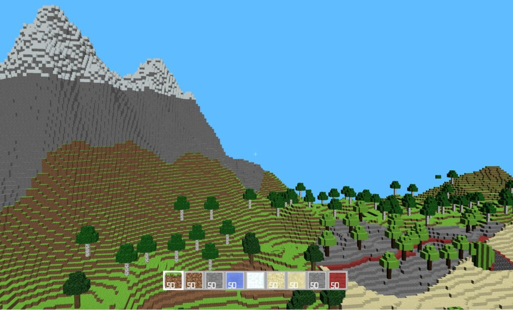
</a>

Built a first-person and interactive 3D World from scratch (no game engine) using C++ and the OpenGL pipeline. The game implements the key features of Minecraft as is described below in the expandable tabs. This includes a diverse landscape with different biomes and terrains, artificial intelligence in the non-playable characters, inventory/crafting systems, and much more. The final product included over 30 pairs of C++ header and source files as well as over a dozen glsl vertex and fragment shader files with over 10,000 total lines of written code. 

For Video overview, click on image to the right

## Procedural Terrain / Cave Systems / Objects
I created a total of four biomes using different procedural and semi-random mathematical functions in order to capture the key characteristics of each given landscape. These four biomes themselves are chosen by the intersection of two semi-random and distinct functions that represent ‘moisture’ and ‘temperature’ where for example the Desert Biome corresponds to a Low-Moisture and High-Temperature environment. These biomes are then blended for fluidity using a linear interpolation function so that the cliffs of a mountain gradually cascade into a desert and the hills of the grassland don’t suddenly flatten once a line is crossed. A given block that is considered can then for example have 60%-20%-5%-15% split for all of its traits/height among the four biomes. Once the height of a block is determined in this manner, certain logical conditions can determine certain attributes including the water levels, snow levels, frequency of trees/objects, dirt, etc. Note that the specifics of the randomness functions are rather complicated but in summary most randomness is built up using Perlin and Worley noise.

In addition to the four biomes that were created there is a system of caves that exist beneath the surface of the walkable world. These can be entered in specific points of the terrain and walked all the way down to the rivers of lava that exist on top of the bedrock that serve as a border for the game (refer to the above video for a walkthrough of this). The key difference in creating this “5th biome” is that instead of having a random function used for determining height, I had to take into account a 3-Dimensional space that could have value of EMPTY/FILLED independent of the blocks above and below it. There were several challenges with this task including the creation of steps down to this space as a natural way into these caves was not as aesthetic.

<table>
  <tr>
    <td>
      
<strong>Desert Biome</strong>

      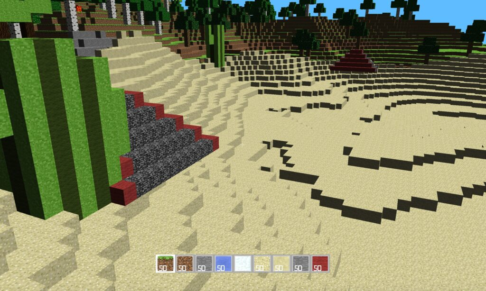
    </td>
    <td>
      
<strong>Mountain Biome</strong>

      
    </td>
  </tr>
  <tr>
    <td>
      
<strong>Forest Biome</strong>

      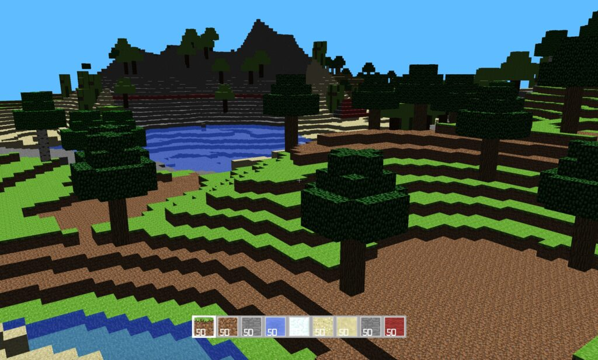
    </td>
    <td>
      
<strong>Grassland Biome</strong>

      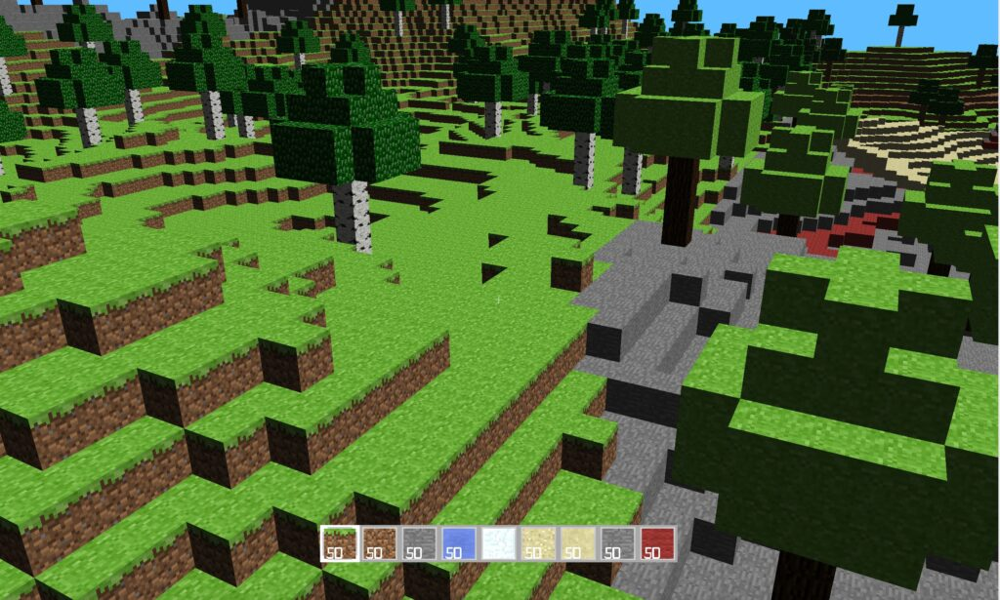
    </td>
  </tr>
</table>

## A.I. Non-Playable Character
<a href="img/AiPlane.png" target="_blank">
    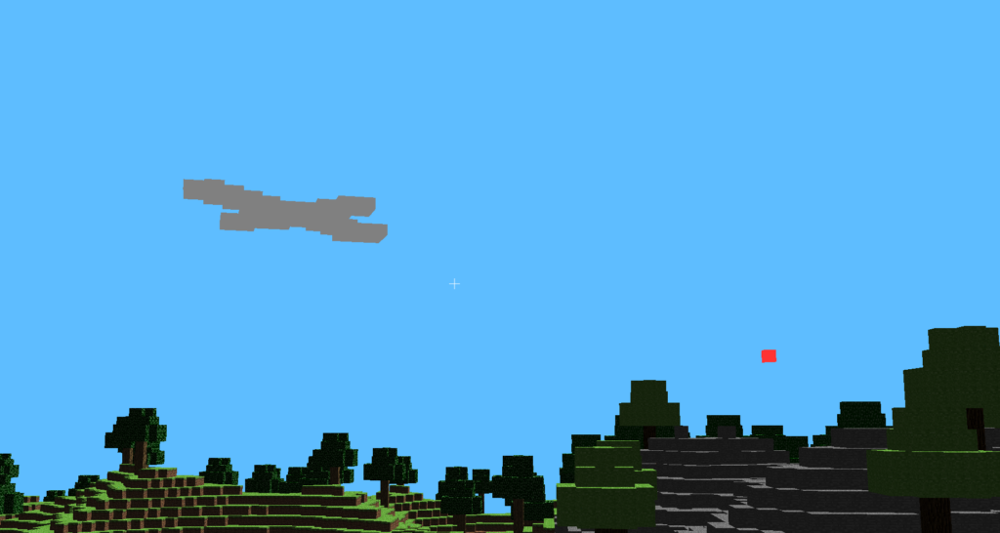
</a>
Hovering above the player in a randomized clover pattern is a ship that periodically drops bombs. This A.I. is loaded in as an obj file that is translated into the global world coordinates after being voxelized so that it can be represented as a grouping of cubes. This entity checks the world space for collisions 100 times every second and if it is about to intersect with a mountain it utilizes a modification of the A* pathfinding algorithm to avoid the obstacle. The A.I. maintains a physical shape so a player within walking mode is able to jump onto the ship if in range and move with it due to friction. In regards to the dropping of the bombs, the terrain will explode as the red block touches the ground with an explosion sound. Note that if the bomb directly hits the player then then entire screen will turn red until the player moves out of the way.

## Multithreaded Terrain Generation
<a href="img/Multithreading1.jpg" target="_blank">
    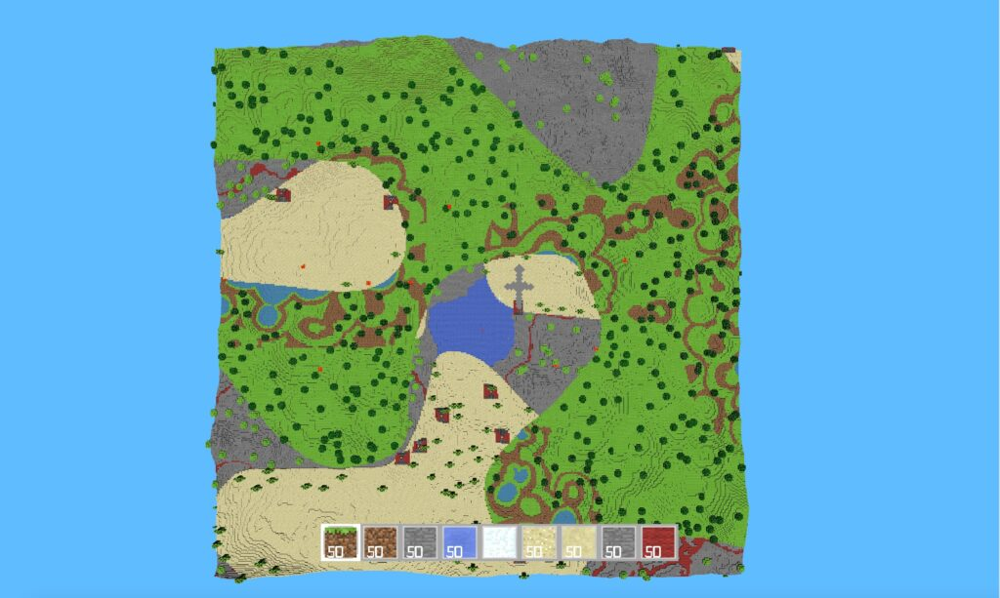
</a>
<a href="img/Multithreading2.jpg" target="_blank">
    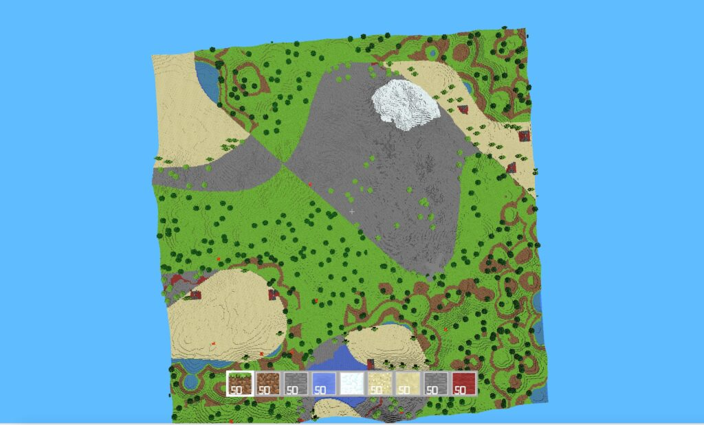
</a>
Multi-threading within this project is used so that the main thread that is viewed by the user is not slowed down by terrain generation that is constantly being updated on child threads. Each child thread is responsible for a specific terrain generation zone that is a grouping of chunks together within a certain radius of the player. In order to load these new zones in there is shared memory through an unordered set in the Terrain class. Furthermore, Mutex’s in the code are used so that certain operations do not occur simultaneously and crash the program.

## Efficient Terrain Rendering and Chunking
<a href="img/EfficientRendering.png" target="_blank">
    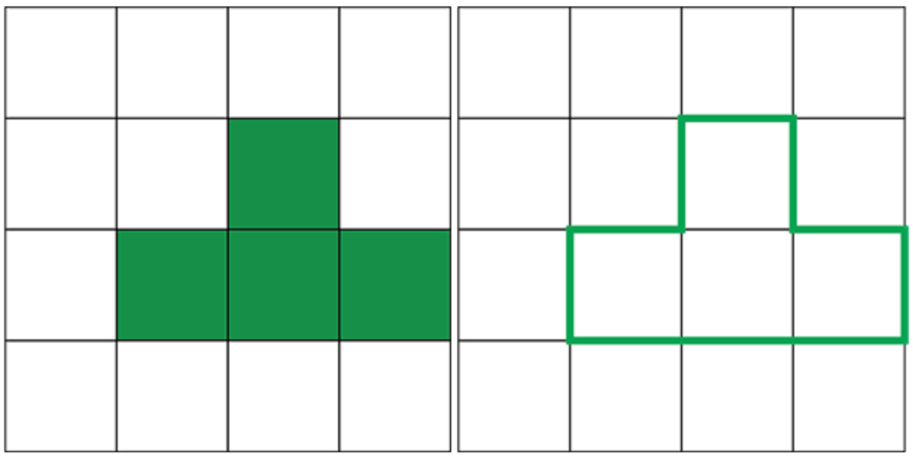
</a>
Having an efficient way of rendering the terrain is an important optimization that allows for quicker gameplay and a larger radius of cubes around the player that can be generated. The image to the right displays this as instead of always rendering the six faces of a cube, connected sides are removed as they represent the inside of a larger shape.

The chunking refers to a 16x16x256 grouping of BlockTypes that allows for efficient generation of new spaces. Each terrain zone contains a set of chunks that are indexed by their location in the global map and are loaded into memory or forgotten based off of the players position. Chunking requires creating objects that inherit from the Drawable class and can be loaded from a given VBO format that contains the specification for a block size.

## Game Engine Tick Function and Player Physics
A tick function within a gaming paradigm is a call to actions on a given time interval with the alternative approach being a purely event-based scheme. I use a tick function for many aspects of the world including the npc character, the player’s collisions, and terrain generation. In tandem with this I implement the typical KeyPressEvents that control the movement of the player and certain actions such as using the inventory and crafting table. The tick function itself is in the abstract Entity class so that ‘Player’ and ‘npc’ can override it as well as in the overarching mygl class as to be used in general gameplay

Player physics is predominantly comprised of collisions and movement when running/jumping in the world. Collisions work through the use of ray tracing in a multitude of directions and lengths every tick so that regardless of the way in which a player approaches an object there will be a detection of it and a change in gameplay. Movement is based off of the classical physics model with a constant downward acceleration that includes a terminal velocity when falling due to air resistance. Further, all typical forces including friction are taken into account in the player’s acceleration as happens when running around the world. Note that none of these are applicable when the player is in flight mode and can move around freely.

## Post-Processing Effects
<a href="img/SwimUnderWater.png" target="_blank">
    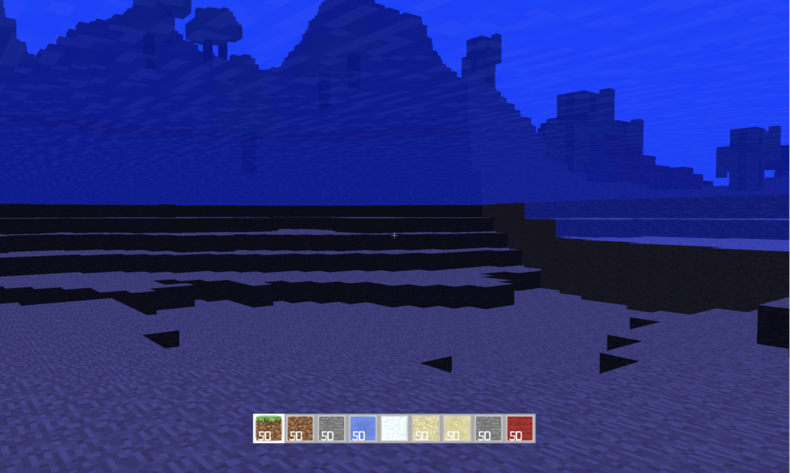
</a>
<a href="img/SwimAboveWater.png" target="_blank">
    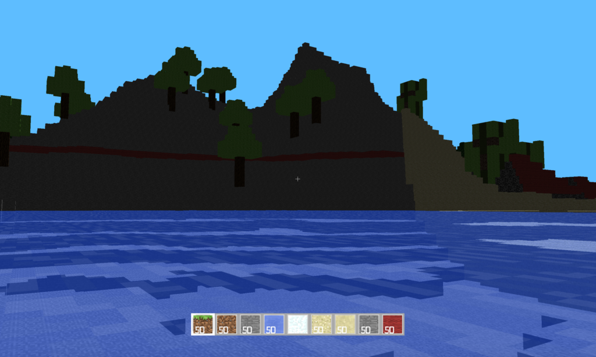
</a>
Post-Processing Effects are used in the world in order to tint the screen blue in water and red in lava. Consider the simplified OpenGL pipeline to be as follows:

Vertex Data > Vertex Shader > Primitive Assembly > Rasterization > Fragment Shader > Frame Buffer

The default FrameBuffer is the screen, so in order to include the desired effect I created a new Buffer object that takes in a quadrangle to fit over the entire game and call new Vertex/Fragment Shaders with it that can then output to what the user sees.

## Texturing and Texture Animation
<a href="img/TextureMapping.png" target="_blank">
    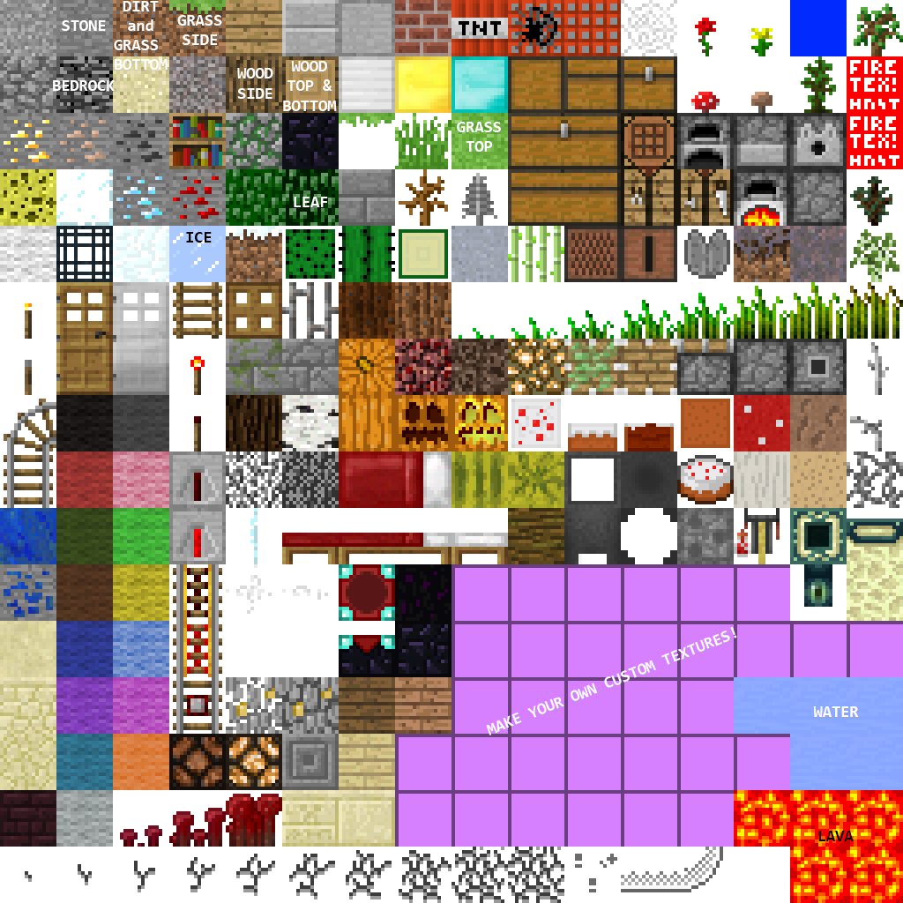
</a>
<a href="img/WorldLoadedTextures.png" target="_blank">
    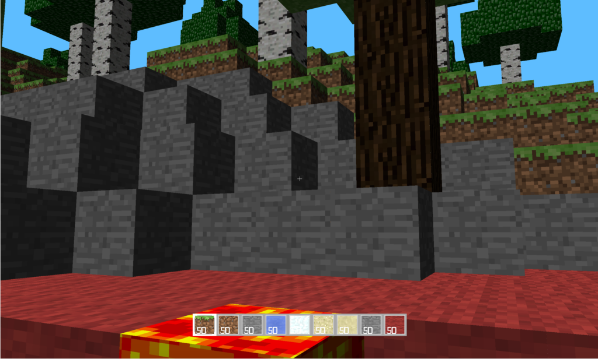
</a>
I used a texture map to link the different images to the faces of each of the cubes used within the terrain. An enumerated BlockType decided how that specific face was to be chosen from the texture map seen to the right. In addition to this, I used a normal map to add depth to the cubes based off of the normal vector from the camera to each pixel within the image.

Further, the alpha coordinate of each pixels color is used as an indicator on the transparency-opaqueness spectrum so that blocks such as water could be seen through while wood does not show anything behind it. In the same vein, all opaque blocks have their color information rendered first as it is not possible to retroactively alter the coloring of a transparent block.

## Inventory / Crafting

<a href="img/Inventory2.png" target="_blank">
    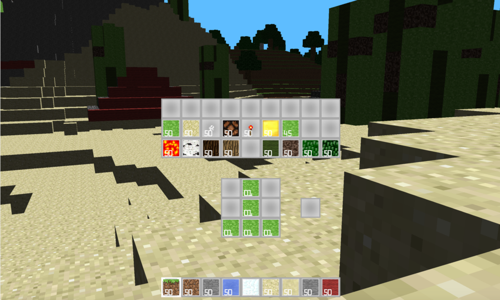
</a>
Similar to the game of Minecraft, a dynamic inventory is shown at the bottom of the screen with the quantities of a chosen eight elements. When the user presses ‘i’ there is a deeper inventory and crafting toolkit that appears with a Drag-And-Drop capability that contains hardcoded recipes for constructing new blocks. Right clicking allows for specific quantities of a uniform block to be distributed to either craft or store differently.

### Redstone
The Redstone capability within Minecraft (and in my miniature version) is a way to create logic and currents that can be used to light up lamps as shown below or perform specific tasks. Using the five gates below we could theoretically build up an entire computer at a large scale that is Turing-Complete. Due to spacial confines this is not truly realistic, but a functionality such as a calculator could certainly be built up within my version of Minecraft. Note that building up this capability included the challenge of having partially transparent blocks as is demonstrated by the lamps. For demonstrations on how each of the gates below work please refer to the last 30 seconds of the video linked above.

<table>
  <tr>
    <td>
      
<strong>AND Gate</strong>

      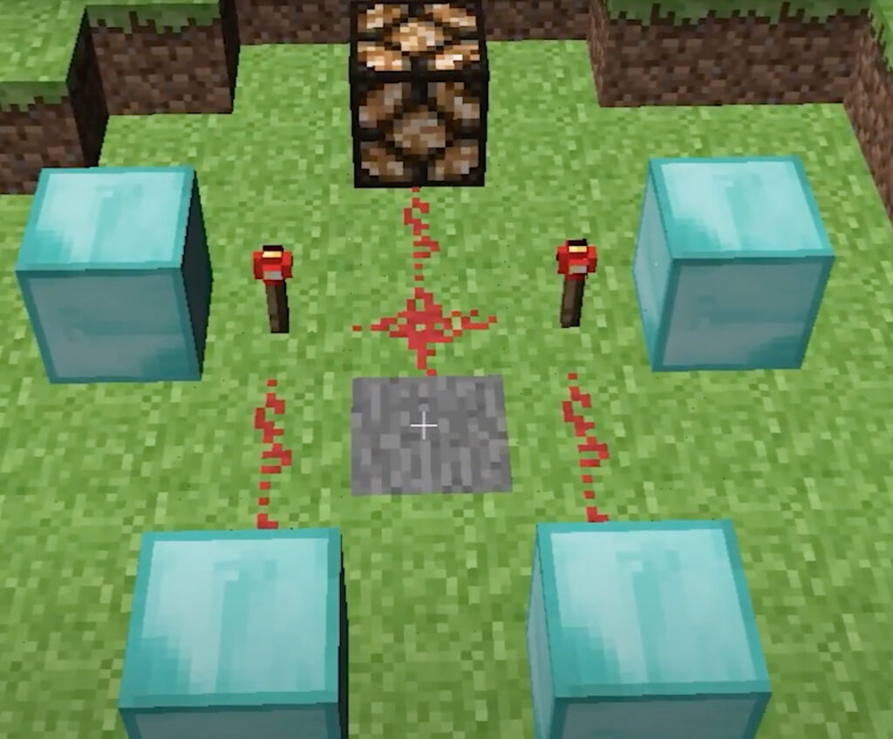
    </td>
    <td>
      
<strong>XOR Gate</strong>

      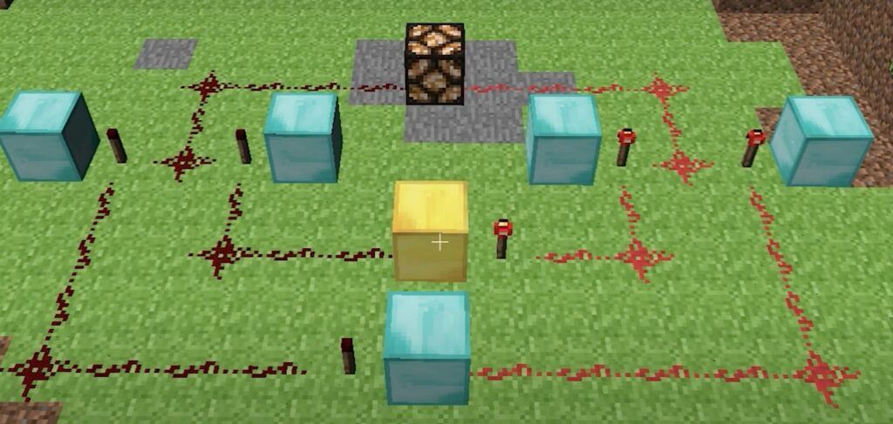
    </td>
  </tr>
   
</table>

